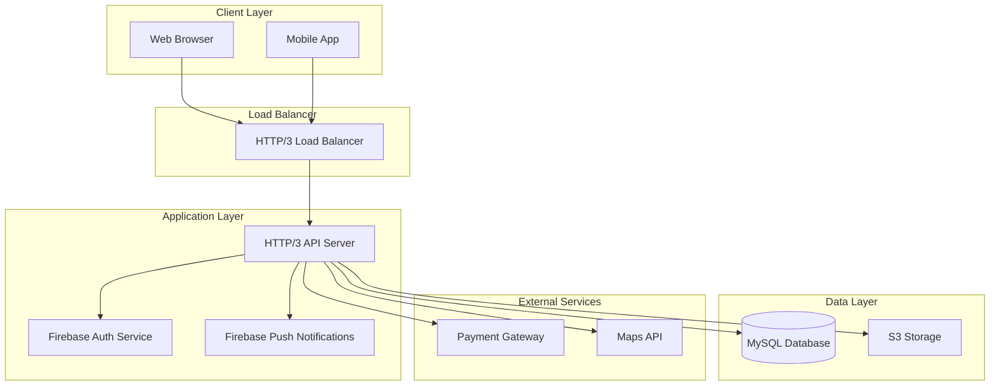

# Design Document - Hotel Restaurant System

## Overview

The Hotel Restaurant System is a comprehensive web application and API server built with Rust, leveraging HTTP/3 with QUIC protocol for optimal performance. The system provides a complete restaurant experience including menu browsing, order management, delivery tracking, and administrative controls. The architecture follows modern microservice principles with clear separation of concerns, robust authentication via Firebase, and efficient data management using MySQL.

## Architecture

### High-Level Architecture



### Technology Stack

- **Backend**: Rust with Tokio async runtime
- **HTTP Protocol**: HTTP/3 with QUIC (h3, h3-quinn, quinn crates)
- **Database**: MySQL with connection pooling
- **Authentication**: Firebase Phone Auth
- **Push Notifications**: Firebase Cloud Messaging (FCM)
- **Session Management**: In-memory or database-based session storage
- **File Storage**: S3-compatible storage for images
- **Environment Configuration**: Environment variables via .env file

## Components and Interfaces

### 1. HTTP/3 Server Component

**Purpose**: Handle incoming HTTP/3 requests with QUIC protocol support and fallback mechanisms.

**Key Features**:
- Self-signed certificate generation for development
- ALPN protocol negotiation (h3, h2, http/1.1)
- Concurrent connection handling with tokio spawning
- Graceful fallback to lower HTTP versions

**Interface**:
```rust
pub struct Http3Server {
    endpoint: Endpoint,
    tls_config: ServerConfig,
}

impl Http3Server {
    pub async fn new(bind_addr: &str) -> Result<Self>;
    pub async fn start(&self) -> Result<()>;
    pub async fn handle_connection(&self, conn: Connection) -> Result<()>;
}
```

### 2. Authentication Service

**Purpose**: Manage user authentication using Firebase Phone Auth and session management.

**Key Features**:
- Firebase Phone Auth integration
- JWT token validation or Basic Auth
- User session management
- Role-based access control (user, admin, delivery_person)

**Interface**:
```rust
pub struct AuthService {
    firebase_client: FirebaseClient,
    jwt_secret: String,
}

impl AuthService {
    pub async fn verify_phone_otp(&self, phone: &str, otp: &str) -> Result<User>;
    pub async fn create_session(&self, user: &User) -> Result<String>;
    pub async fn validate_token(&self, token: &str) -> Result<Claims>;
    pub fn check_permissions(&self, user_type: &str, resource: &str) -> bool;
}
```

### 3. Database Service

**Purpose**: Handle all database operations with connection pooling and transaction management.

**Key Features**:
- MySQL connection pooling
- Transaction management
- Query optimization with prepared statements
- Database migration support

**Interface**:
```rust
pub struct DatabaseService {
    pool: Pool<MySql>,
}

impl DatabaseService {
    pub async fn new(database_url: &str) -> Result<Self>;
    pub async fn get_connection(&self) -> Result<PoolConnection<MySql>>;
    pub async fn execute_transaction<F, T>(&self, f: F) -> Result<T>
    where F: FnOnce(&mut Transaction<MySql>) -> BoxFuture<Result<T>>;
}
```

### 4. Menu Management Service

**Purpose**: Handle menu item operations, categories, and availability management.

**Interface**:
```rust
pub struct MenuService {
    db: Arc<DatabaseService>,
    cache: Arc<CacheService>,
}

impl MenuService {
    pub async fn get_menu_items(&self, filters: MenuFilters) -> Result<Vec<MenuItem>>;
    pub async fn search_menu(&self, query: &str, filters: MenuFilters) -> Result<Vec<MenuItem>>;
    pub async fn update_availability(&self, item_id: i64, available: bool) -> Result<()>;
    pub async fn get_categories(&self) -> Result<Vec<Category>>;
}
```

### 5. Order Management Service

**Purpose**: Handle order lifecycle from creation to delivery completion.

**Interface**:
```rust
pub struct OrderService {
    db: Arc<DatabaseService>,
    payment_service: Arc<PaymentService>,
    notification_service: Arc<NotificationService>,
}

impl OrderService {
    pub async fn create_order(&self, order_request: CreateOrderRequest) -> Result<Order>;
    pub async fn update_order_status(&self, order_id: i64, status: OrderStatus) -> Result<()>;
    pub async fn get_orders(&self, user_id: i64, filters: OrderFilters) -> Result<Vec<Order>>;
    pub async fn assign_delivery_person(&self, order_id: i64, delivery_person_id: i64) -> Result<()>;
}
```

### 6. Payment Service

**Purpose**: Handle payment processing with multiple payment methods.

**Interface**:
```rust
pub struct PaymentService {
    gateway_config: PaymentGatewayConfig,
}

impl PaymentService {
    pub async fn process_payment(&self, payment_request: PaymentRequest) -> Result<PaymentResponse>;
    pub async fn verify_payment(&self, transaction_id: &str) -> Result<PaymentStatus>;
    pub async fn process_refund(&self, payment_id: i64, amount: Decimal) -> Result<RefundResponse>;
}
```

### 7. Notification Service

**Purpose**: Handle Firebase push notifications and communication.

**Interface**:
```rust
pub struct NotificationService {
    fcm_client: FcmClient,
}

impl NotificationService {
    pub async fn send_order_notification(&self, user_id: i64, message: OrderNotification) -> Result<()>;
    pub async fn send_bulk_notification(&self, user_ids: Vec<i64>, message: BulkNotification) -> Result<()>;
    pub async fn send_delivery_notification(&self, delivery_person_id: i64, message: DeliveryNotification) -> Result<()>;
}
```

### 8. Admin Service

**Purpose**: Handle administrative operations and system management.

**Interface**:
```rust
pub struct AdminService {
    db: Arc<DatabaseService>,
    config_service: Arc<ConfigService>,
}

impl AdminService {
    pub async fn get_dashboard_metrics(&self) -> Result<DashboardMetrics>;
    pub async fn manage_users(&self, action: UserAction) -> Result<()>;
    pub async fn get_analytics(&self, date_range: DateRange) -> Result<Analytics>;
    pub async fn update_system_config(&self, config: SystemConfig) -> Result<()>;
}
```

## Data Models

### Core Data Structures

```rust
// User Management
#[derive(Debug, Serialize, Deserialize)]
pub struct User {
    pub id: i64,
    pub name: String,
    pub email: Option<String>,
    pub firebase_uid: String,
    pub phone_number: String,
    pub phone_verified: bool,
    pub user_type: UserType, // user (default), admin, delivery_person
    pub is_active: bool,
    pub delivery_addresses: Option<Vec<Address>>,
    pub preferences: Option<UserPreferences>,
    pub created_at: DateTime<Utc>,
    pub updated_at: DateTime<Utc>,
}

#[derive(Debug, Serialize, Deserialize)]
pub enum UserType {
    User,
    Admin,
    DeliveryPerson,
}

// Menu Management
#[derive(Debug, Serialize, Deserialize)]
pub struct MenuItem {
    pub id: i64,
    pub name: String,
    pub description: String,
    pub price: Decimal,
    pub category: String,
    pub image_url: Option<String>,
    pub is_available: bool,
    pub is_vegetarian: bool,
    pub is_vegan: bool,
    pub ingredients: Vec<String>,
    pub allergens: Vec<String>,
    pub preparation_time: i32, // minutes
    pub sort_order: i32,
    pub created_at: DateTime<Utc>,
    pub updated_at: DateTime<Utc>,
}

// Order Management
#[derive(Debug, Serialize, Deserialize)]
pub struct Order {
    pub id: i64,
    pub order_number: String,
    pub user_id: i64,
    pub status: OrderStatus,
    pub delivery_address: Address,
    pub delivery_latitude: f64,
    pub delivery_longitude: f64,
    pub delivery_distance: f64,
    pub subtotal: Decimal,
    pub delivery_fee: Decimal,
    pub tax_amount: Decimal,
    pub tip_amount: Option<Decimal>,
    pub total_amount: Decimal,
    pub payment_status: PaymentStatus,
    pub payment_method: PaymentMethod,
    pub delivery_person_id: Option<i64>,
    pub estimated_delivery_time: Option<DateTime<Utc>>,
    pub actual_delivery_time: Option<DateTime<Utc>>,
    pub special_instructions: Option<String>,
    pub created_at: DateTime<Utc>,
    pub updated_at: DateTime<Utc>,
}

#[derive(Debug, Serialize, Deserialize, Clone, PartialEq)]
pub enum OrderStatus {
    Pending,
    Confirmed,
    Preparing,
    ReadyForPickup,
    OutForDelivery,
    Delivered,
    Cancelled,
}

impl OrderStatus {
    pub fn as_str(&self) -> &'static str {
        match self {
            Self::Pending => "pending",
            Self::Confirmed => "confirmed",
            Self::Preparing => "preparing",
            Self::ReadyForPickup => "ready_for_pickup",
            Self::OutForDelivery => "out_for_delivery",
            Self::Delivered => "delivered",
            Self::Cancelled => "cancelled",
        }
    }

    pub fn label(&self) -> &'static str {
        match self {
            Self::Pending => "Pending",
            Self::Confirmed => "Confirmed",
            Self::Preparing => "Preparing",
            Self::ReadyForPickup => "Ready for Pickup",
            Self::OutForDelivery => "Out for Delivery",
            Self::Delivered => "Delivered",
            Self::Cancelled => "Cancelled",
        }
    }

    pub fn icon(&self) -> &'static str {
        match self {
            Self::Pending => "⏳",
            Self::Confirmed => "✅",
            Self::Preparing => "👨‍🍳",
            Self::ReadyForPickup => "📦",
            Self::OutForDelivery => "🚚",
            Self::Delivered => "🎉",
            Self::Cancelled => "❌",
        }
    }

    pub fn color(&self) -> &'static str {
        match self {
            Self::Pending => "#FFA500",
            Self::Confirmed => "#32CD32",
            Self::Preparing => "#1E90FF",
            Self::ReadyForPickup => "#9370DB",
            Self::OutForDelivery => "#FF6347",
            Self::Delivered => "#228B22",
            Self::Cancelled => "#DC143C",
        }
    }

    pub fn all() -> Vec<OrderStatusInfo> {
        vec![
            OrderStatusInfo::from(&Self::Pending),
            OrderStatusInfo::from(&Self::Confirmed),
            OrderStatusInfo::from(&Self::Preparing),
            OrderStatusInfo::from(&Self::ReadyForPickup),
            OrderStatusInfo::from(&Self::OutForDelivery),
            OrderStatusInfo::from(&Self::Delivered),
            OrderStatusInfo::from(&Self::Cancelled),
        ]
    }
}

#[derive(Debug, Serialize, Deserialize)]
pub struct OrderStatusInfo {
    pub value: String,
    pub label: String,
    pub icon: String,
    pub color: String,
}

impl From<&OrderStatus> for OrderStatusInfo {
    fn from(status: &OrderStatus) -> Self {
        Self {
            value: status.as_str().to_string(),
            label: status.label().to_string(),
            icon: status.icon().to_string(),
            color: status.color().to_string(),
        }
    }
}

// Payment Management
#[derive(Debug, Serialize, Deserialize, Clone, PartialEq)]
pub enum PaymentMethod {
    CashOnDelivery,
    Upi,
    DebitCard,
    CreditCard,
    NetBanking,
    DigitalWallet,
}

impl PaymentMethod {
    pub fn as_str(&self) -> &'static str {
        match self {
            Self::CashOnDelivery => "cod",
            Self::Upi => "upi",
            Self::DebitCard => "debit_card",
            Self::CreditCard => "credit_card",
            Self::NetBanking => "net_banking",
            Self::DigitalWallet => "digital_wallet",
        }
    }

    pub fn label(&self) -> &'static str {
        match self {
            Self::CashOnDelivery => "Cash on Delivery",
            Self::Upi => "UPI",
            Self::DebitCard => "Debit Card",
            Self::CreditCard => "Credit Card",
            Self::NetBanking => "Net Banking",
            Self::DigitalWallet => "Digital Wallet",
        }
    }

    pub fn icon(&self) -> &'static str {
        match self {
            Self::CashOnDelivery => "💵",
            Self::Upi => "📱",
            Self::DebitCard => "💳",
            Self::CreditCard => "💳",
            Self::NetBanking => "🏦",
            Self::DigitalWallet => "📲",
        }
    }

    pub fn is_online(&self) -> bool {
        match self {
            Self::CashOnDelivery => false,
            _ => true,
        }
    }

    pub fn all() -> Vec<PaymentMethodInfo> {
        vec![
            PaymentMethodInfo::from(&Self::CashOnDelivery),
            PaymentMethodInfo::from(&Self::Upi),
            PaymentMethodInfo::from(&Self::DebitCard),
            PaymentMethodInfo::from(&Self::CreditCard),
            PaymentMethodInfo::from(&Self::NetBanking),
            PaymentMethodInfo::from(&Self::DigitalWallet),
        ]
    }
}

#[derive(Debug, Serialize, Deserialize)]
pub struct PaymentMethodInfo {
    pub value: String,
    pub label: String,
    pub icon: String,
    pub is_online: bool,
}

impl From<&PaymentMethod> for PaymentMethodInfo {
    fn from(method: &PaymentMethod) -> Self {
        Self {
            value: method.as_str().to_string(),
            label: method.label().to_string(),
            icon: method.icon().to_string(),
            is_online: method.is_online(),
        }
    }
}

#[derive(Debug, Serialize, Deserialize, Clone, PartialEq)]
pub enum PaymentStatus {
    Pending,
    Processing,
    Completed,
    Failed,
    Refunded,
    PartiallyRefunded,
}

impl PaymentStatus {
    pub fn as_str(&self) -> &'static str {
        match self {
            Self::Pending => "pending",
            Self::Processing => "processing",
            Self::Completed => "completed",
            Self::Failed => "failed",
            Self::Refunded => "refunded",
            Self::PartiallyRefunded => "partially_refunded",
        }
    }

    pub fn label(&self) -> &'static str {
        match self {
            Self::Pending => "Pending",
            Self::Processing => "Processing",
            Self::Completed => "Completed",
            Self::Failed => "Failed",
            Self::Refunded => "Refunded",
            Self::PartiallyRefunded => "Partially Refunded",
        }
    }

    pub fn icon(&self) -> &'static str {
        match self {
            Self::Pending => "⏳",
            Self::Processing => "🔄",
            Self::Completed => "✅",
            Self::Failed => "❌",
            Self::Refunded => "↩️",
            Self::PartiallyRefunded => "↪️",
        }
    }

    pub fn color(&self) -> &'static str {
        match self {
            Self::Pending => "#FFA500",
            Self::Processing => "#1E90FF",
            Self::Completed => "#228B22",
            Self::Failed => "#DC143C",
            Self::Refunded => "#9370DB",
            Self::PartiallyRefunded => "#FF6347",
        }
    }
}

// Delivery Management
#[derive(Debug, Serialize, Deserialize)]
pub struct DeliveryPersonnel {
    pub id: i64,
    pub user_id: i64,
    pub vehicle_type: String,
    pub vehicle_number: String,
    pub license_number: String,
    pub upi_address: Option<String>,
    pub status: DeliveryStatus,
    pub current_latitude: Option<f64>,
    pub current_longitude: Option<f64>,
    pub last_location_update: Option<DateTime<Utc>>,
    pub rating: Option<f64>,
    pub total_deliveries: i32,
    pub total_earnings: Decimal,
    pub is_active: bool,
    pub created_at: DateTime<Utc>,
    pub updated_at: DateTime<Utc>,
}

// System Configuration
#[derive(Debug, Serialize, Deserialize)]
pub struct SystemConfiguration {
    pub key: String,
    pub value: String,
    pub created_at: DateTime<Utc>,
    pub updated_at: DateTime<Utc>,
}
```

### Database Schema Design

The system uses MySQL with the following key tables:

1. **users** - User account information with Firebase integration
2. **menu_items** - Restaurant menu with categories and attributes
3. **orders** - Order information with delivery details
4. **order_items** - Individual items within orders
5. **delivery_personnel** - Delivery person profiles and status
6. **payments** - Payment transaction records
7. **tip_transactions** - Tip processing for delivery personnel
8. **system_configurations** - Dynamic system settings

## Error Handling

### Error Types

```rust
#[derive(Debug, thiserror::Error)]
pub enum AppError {
    #[error("Database error: {0}")]
    Database(#[from] sqlx::Error),
    
    #[error("Authentication error: {0}")]
    Authentication(String),
    
    #[error("Authorization error: {0}")]
    Authorization(String),
    
    #[error("Validation error: {0}")]
    Validation(String),
    
    #[error("Payment error: {0}")]
    Payment(String),
    
    #[error("External service error: {0}")]
    ExternalService(String),
    
    #[error("Configuration error: {0}")]
    Configuration(String),
}
```

### Error Response Format

```rust
#[derive(Debug, Serialize)]
pub struct ErrorResponse {
    pub error: String,
    pub message: String,
    pub code: u16,
    pub timestamp: DateTime<Utc>,
    pub request_id: String,
}
```

## Testing Strategy

### Unit Testing
- Individual service method testing
- Mock database connections for isolated testing
- Firebase service mocking for authentication tests
- Payment gateway mocking for transaction tests

### Integration Testing
- End-to-end API endpoint testing
- Database integration with test containers
- Firebase integration testing with test project
- HTTP/3 protocol testing with real connections

### Performance Testing
- Load testing with HTTP/3 connections
- Database query performance optimization
- Concurrent user simulation
- Memory and CPU usage profiling

### Security Testing
- Authentication bypass testing
- SQL injection prevention validation
- Input sanitization verification
- Rate limiting effectiveness testing

## Deployment Architecture

### Environment Configuration

The system uses environment variables for configuration management:

```rust
#[derive(Debug)]
pub struct AppConfig {
    pub app_name: String,
    pub database_url: String,
    pub firebase_project_id: String,
    pub firebase_api_key: String,
    pub server_host: String,
    pub server_port: u16,

    pub s3_bucket_endpoint: String,
    pub s3_access_key: String,
    pub s3_secret_key: String,
}

impl AppConfig {
    pub fn from_env() -> Result<Self> {
        Ok(Self {
            app_name: env::var("APP_NAME").unwrap_or_else(|_| "Hotel Restaurant".to_string()),
            database_url: env::var("DATABASE_URL").expect("DATABASE_URL must be set"),
            firebase_project_id: env::var("FIREBASE_PROJECT_ID").expect("FIREBASE_PROJECT_ID must be set"),
            firebase_api_key: env::var("FIREBASE_API_KEY").expect("FIREBASE_API_KEY must be set"),
            server_host: env::var("SERVER_HOST").unwrap_or_else(|_| "127.0.0.1".to_string()),
            server_port: env::var("SERVER_PORT").unwrap_or_else(|_| "443".to_string()).parse()?,

            s3_bucket_endpoint: env::var("S3_BUCKET_ENDPOINT").expect("S3_BUCKET_ENDPOINT must be set"),
            s3_access_key: env::var("S3_ACCESS_KEY").expect("S3_ACCESS_KEY must be set"),
            s3_secret_key: env::var("S3_SECRET_KEY").expect("S3_SECRET_KEY must be set"),
        })
    }
}
```

## Utility Services

### Currency Helper Service

**Purpose**: Handle currency formatting, conversion, and localization based on environment configuration.

```rust
use rust_decimal::Decimal;
use serde::{Deserialize, Serialize};
use std::collections::HashMap;

#[derive(Debug, Clone, Serialize, Deserialize)]
pub struct CurrencyConfig {
    pub code: String,
    pub symbol: String,
    pub name: String,
    pub decimal_places: u8,
    pub thousands_separator: String,
    pub decimal_separator: String,
    pub symbol_before: bool,
    pub rates: HashMap<String, Decimal>,
}

impl Default for CurrencyConfig {
    fn default() -> Self {
        Self {
            code: "INR".to_string(),
            symbol: "₹".to_string(),
            name: "Rupees".to_string(),
            decimal_places: 2,
            thousands_separator: ",".to_string(),
            decimal_separator: ".".to_string(),
            symbol_before: true,
            rates: HashMap::new(),
        }
    }
}

pub struct CurrencyHelper {
    config: CurrencyConfig,
}

impl CurrencyHelper {
    pub fn new(config: CurrencyConfig) -> Self {
        Self { config }
    }

    pub fn from_env() -> Self {
        let config = CurrencyConfig {
            code: std::env::var("APP_CURRENCY").unwrap_or_else(|_| "INR".to_string()),
            symbol: std::env::var("APP_CURRENCY_SYMBOL").unwrap_or_else(|_| "₹".to_string()),
            name: std::env::var("APP_CURRENCY_NAME").unwrap_or_else(|_| "Rupees".to_string()),
            decimal_places: std::env::var("APP_CURRENCY_DECIMAL_PLACES")
                .unwrap_or_else(|_| "2".to_string())
                .parse()
                .unwrap_or(2),
            thousands_separator: std::env::var("APP_CURRENCY_THOUSANDS_SEP")
                .unwrap_or_else(|_| ",".to_string()),
            decimal_separator: std::env::var("APP_CURRENCY_DECIMAL_SEP")
                .unwrap_or_else(|_| ".".to_string()),
            symbol_before: std::env::var("APP_CURRENCY_SYMBOL_BEFORE")
                .unwrap_or_else(|_| "true".to_string())
                .parse()
                .unwrap_or(true),
            rates: HashMap::new(), // Could be loaded from external service
        };
        Self::new(config)
    }

    /// Format amount with currency symbol
    pub fn format(&self, amount: Decimal, currency_code: Option<&str>) -> String {
        let currency_code = currency_code.unwrap_or(&self.config.code);
        let formatted_number = self.format_number(amount);
        
        if self.config.symbol_before {
            format!("{}{}", self.config.symbol, formatted_number)
        } else {
            format!("{}{}", formatted_number, self.config.symbol)
        }
    }

    /// Format amount without currency symbol
    pub fn format_number(&self, amount: Decimal) -> String {
        let amount_str = format!("{:.1$}", amount, self.config.decimal_places as usize);
        
        // Split into integer and decimal parts
        let parts: Vec<&str> = amount_str.split('.').collect();
        let integer_part = parts[0];
        let decimal_part = if parts.len() > 1 { parts[1] } else { "" };
        
        // Add thousands separators
        let formatted_integer = self.add_thousands_separator(integer_part);
        
        if self.config.decimal_places > 0 && !decimal_part.is_empty() {
            format!("{}{}{}", formatted_integer, self.config.decimal_separator, decimal_part)
        } else {
            formatted_integer
        }
    }

    /// Add thousands separator to integer part
    fn add_thousands_separator(&self, integer_str: &str) -> String {
        let chars: Vec<char> = integer_str.chars().collect();
        let mut result = String::new();
        
        for (i, ch) in chars.iter().enumerate() {
            if i > 0 && (chars.len() - i) % 3 == 0 {
                result.push_str(&self.config.thousands_separator);
            }
            result.push(*ch);
        }
        
        result
    }

    /// Get currency symbol
    pub fn symbol(&self) -> &str {
        &self.config.symbol
    }

    /// Get currency code
    pub fn code(&self) -> &str {
        &self.config.code
    }

    /// Get currency name
    pub fn name(&self) -> &str {
        &self.config.name
    }

    /// Convert amount between currencies
    pub fn convert(&self, amount: Decimal, from: &str, to: &str) -> Result<Decimal, String> {
        if from == to {
            return Ok(amount);
        }

        let from_rate = self.config.rates.get(from)
            .ok_or_else(|| format!("Exchange rate not found for currency: {}", from))?;
        
        let to_rate = self.config.rates.get(to)
            .ok_or_else(|| format!("Exchange rate not found for currency: {}", to))?;

        // Convert to base currency first, then to target currency
        let base_amount = amount / from_rate;
        Ok(base_amount * to_rate)
    }

    /// Get all supported currencies
    pub fn supported_currencies(&self) -> Vec<CurrencyInfo> {
        let mut currencies = vec![
            CurrencyInfo {
                code: self.config.code.clone(),
                symbol: self.config.symbol.clone(),
                name: self.config.name.clone(),
                is_default: true,
            }
        ];

        for (code, _rate) in &self.config.rates {
            if code != &self.config.code {
                currencies.push(CurrencyInfo {
                    code: code.clone(),
                    symbol: self.get_symbol_for_code(code),
                    name: self.get_name_for_code(code),
                    is_default: false,
                });
            }
        }

        currencies
    }

    /// Get symbol for currency code (could be extended with a lookup table)
    fn get_symbol_for_code(&self, code: &str) -> String {
        match code {
            "USD" => "$".to_string(),
            "EUR" => "€".to_string(),
            "GBP" => "£".to_string(),
            "JPY" => "¥".to_string(),
            "INR" => "₹".to_string(),
            _ => code.to_string(),
        }
    }

    /// Get name for currency code (could be extended with a lookup table)
    fn get_name_for_code(&self, code: &str) -> String {
        match code {
            "USD" => "US Dollar".to_string(),
            "EUR" => "Euro".to_string(),
            "GBP" => "British Pound".to_string(),
            "JPY" => "Japanese Yen".to_string(),
            "INR" => "Indian Rupee".to_string(),
            _ => code.to_string(),
        }
    }

    /// Format price range (e.g., "₹100 - ₹500")
    pub fn format_range(&self, min_amount: Decimal, max_amount: Decimal) -> String {
        format!("{} - {}", self.format(min_amount, None), self.format(max_amount, None))
    }

    /// Parse formatted currency string back to Decimal
    pub fn parse(&self, formatted_amount: &str) -> Result<Decimal, String> {
        let cleaned = formatted_amount
            .replace(&self.config.symbol, "")
            .replace(&self.config.thousands_separator, "")
            .replace(&self.config.decimal_separator, ".")
            .trim()
            .to_string();

        cleaned.parse::<Decimal>()
            .map_err(|e| format!("Failed to parse currency amount: {}", e))
    }
}

#[derive(Debug, Serialize, Deserialize)]
pub struct CurrencyInfo {
    pub code: String,
    pub symbol: String,
    pub name: String,
    pub is_default: bool,
}

// Usage examples and tests
#[cfg(test)]
mod tests {
    use super::*;
    use rust_decimal_macros::dec;

    #[test]
    fn test_currency_formatting() {
        let helper = CurrencyHelper::from_env();
        
        assert_eq!(helper.format(dec!(1234.56), None), "₹1,234.56");
        assert_eq!(helper.format_number(dec!(1000)), "1,000.00");
        assert_eq!(helper.symbol(), "₹");
        assert_eq!(helper.code(), "INR");
    }

    #[test]
    fn test_currency_parsing() {
        let helper = CurrencyHelper::from_env();
        
        assert_eq!(helper.parse("₹1,234.56").unwrap(), dec!(1234.56));
        assert_eq!(helper.parse("1,000.00").unwrap(), dec!(1000.00));
    }
}
```

### Scalability Considerations

1. **Horizontal Scaling**: Multiple server instances behind load balancer
2. **Database Scaling**: Read replicas for query optimization
3. **Caching Strategy**: In-memory caching for frequently accessed data and database-based session storage
4. **CDN Integration**: Static asset delivery optimization
5. **Connection Pooling**: Efficient database connection management

### Security Measures

1. **TLS/SSL**: HTTP/3 with QUIC provides built-in encryption
2. **Authentication**: Firebase Phone Auth with JWT tokens
3. **Authorization**: Role-based access control (RBAC)
4. **Input Validation**: Comprehensive request validation
5. **Rate Limiting**: API endpoint protection
6. **SQL Injection Prevention**: Prepared statements and parameterized queries

This design provides a robust, scalable, and secure foundation for the hotel restaurant system while leveraging modern technologies like HTTP/3 with QUIC for optimal performance.